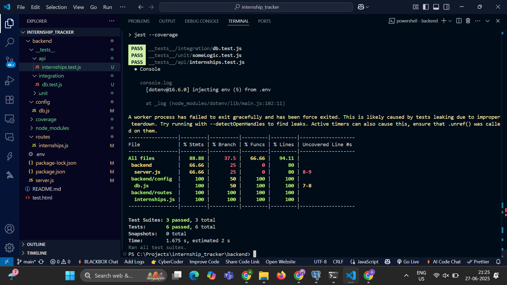

# Internship Tracker API

A simple Node.js + PostgreSQL API to track internship applications, built with Express and tested using Jest and Supertest.

---

## 📌 Features

- CRUD API to manage internships
- PostgreSQL integration
- Structured routes and config
- Tests with >88% code coverage

---

## ⚙️ Tech Stack

- **Backend:** Node.js, Express.js
- **Database:** PostgreSQL
- **Testing:** Jest, Supertest

---

## 📁 Folder Structure

```
backend/
├── config/           # Database connection config
├── routes/           # Express route handlers
├── __tests__/        # API, integration, unit tests
│   ├── api/
│   ├── integration/
│   └── unit/
├── .env              # Environment variables
├── server.js         # Main server entry point
└── package.json
```

---

## 🧪 Running Tests

Make sure PostgreSQL is running and your `.env` is correctly set.

```bash
npm install
npm test
```

✅ Includes API, unit and integration tests.  
Test coverage as of now:

---

## 📦 API Endpoints

Base URL: `http://localhost:5000/api/internships`

| Method | Endpoint           | Description                  |
|--------|--------------------|------------------------------|
| GET    | `/`                | Fetch all internships        |
| POST   | `/`                | Add new internship           |
| PUT    | `/:id`             | Update internship by ID      |
| DELETE | `/:id`             | Delete internship by ID      |

### 📥 Sample POST Body (JSON)
```json
{
  "company": "OpenAI",
  "role": "AI Intern",
  "status": "Applied",
  "applied_on": "2025-06-19"
}
```

---

## 🛠 Setup Instructions

1. Clone the repository:
   ```bash
   git clone https://github.com/yourusername/internship-tracker.git
   cd internship-tracker/backend
   ```

2. Set up your `.env` file:
   ```env
   PG_USER=your_pg_username
   PG_PASSWORD=your_pg_password
   PG_HOST=localhost
   PG_PORT=5432
   PG_DATABASE=internships
   ```

3. Create the PostgreSQL table:
   ```sql
   CREATE TABLE internships (
     id SERIAL PRIMARY KEY,
     company TEXT,
     role TEXT,
     status TEXT,
     applied_on DATE
   );
   ```

4. Run the server:
   ```bash
   npm start
   ```
---
## 🧠 Author
**Ashaz Akram**  
[GitHub Profile](https://github.com/ashaz4)